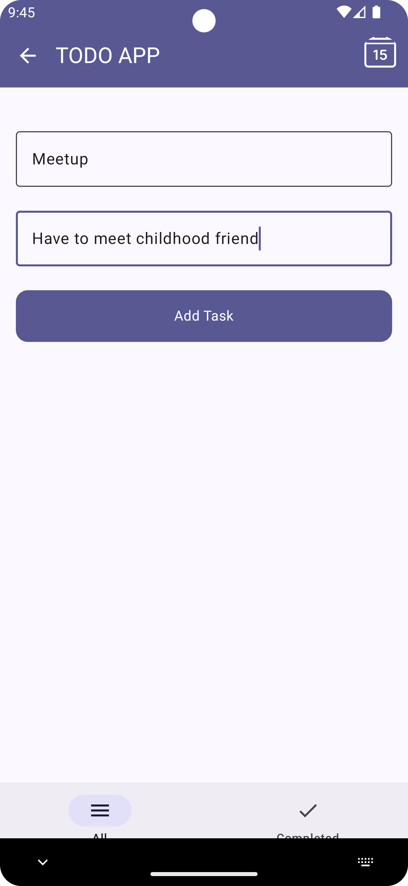

# Todo List App 📋

A modern **Todo List Android App** built using **Jetpack Compose**, **Room Database**, **Kotlin Flows**, and **Coroutines**. This app allows users to manage their daily tasks efficiently with a clean and simple UI.

## 📸 Screenshots
  
  
  
  

---

## 🚀 Features

- **Jetpack Compose UI** for building declarative and modern UIs.
- **Room Database** to store todos locally on the device.
- **Kotlin Flows** to observe changes in the data in a reactive way.
- **Coroutines** for asynchronous and background operations.
- **Add, Update, and Delete Tasks** to manage todos effortlessly.
- **Live Task Updates** with Kotlin Flow and Room integration.
- Clean and structured code following **MVVM Architecture**.

---

## 🛠️ Tech Stack

- **Kotlin** - Programming Language
- **Jetpack Compose** - UI Toolkit for Android
- **Room Database** - Local data persistence
- **Kotlin Flows** - Reactive programming
- **Coroutines** - Asynchronous operations
- **MVVM Architecture** - Model-View-ViewModel design pattern

---

